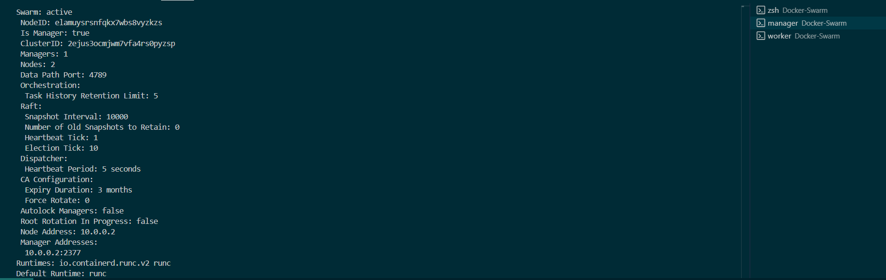

# Using-Docker-Swarm-to-Containerise-Applications

# Docker Swarm Project

## Overview

This documentation outlines the steps to set up a Docker Swarm project on Hetzner Cloud using WSL Debian. The project will feature a three-tier application architecture, utilizing Traefik as a reverse proxy, a frontend application with a user-friendly interface, a database, and additional components to enhance functionality. This setup aims to provide a robust environment suitable for demonstration purposes in a Docker developer job application.

## Table of Contents

- [Using-Docker-Swarm-to-Containerise-Applications](#using-docker-swarm-to-containerise-applications)
- [Docker Swarm Project](#docker-swarm-project)
  - [Overview](#overview)
  - [Table of Contents](#table-of-contents)
  - [Setting Up on Hetzner Cloud](#setting-up-on-hetzner-cloud)
  - [Pointing DNS Records to Hetzner Server IP](#pointing-dns-records-to-hetzner-server-ip)
  - [Initializing Docker Swarm](#initializing-docker-swarm)
  - [Add A Worker Node](#add-a-worker-node)
    - [Create Network for Traefik Proxy](#create-network-for-traefik-proxy)
  - [Configuration of the Three-Tier Application](#configuration-of-the-three-tier-application)
  - [Docker Compose Configurations](#docker-compose-configurations)
    - [Docker Swarm Commands](#docker-swarm-commands)
  - [Accessing the Frontend](#accessing-the-frontend)
    - [Create a Container Management Service](#create-a-container-management-service)
  - [Conclusion](#conclusion)

## Setting Up on Hetzner Cloud

1. **Create a Hetzner Cloud Account**: Sign up for a Hetzner Cloud account if you don’t have one.
2. **Create a New Project**: Navigate to the Hetzner Cloud Console and create a new project.
3. **Deploy a Server**:
   - Choose a server type (e.g., CX11).
   - Select a Debian image.
   - Choose a data center region.
   - Set up SSH keys for secure access.
4. **Launch the Server**: Click on "Create Server" to launch your instance.<p>

This is what the set up should look like:


## Pointing DNS Records to Hetzner Server IP

1. **Obtain the Server IP Address**: After launching the server, note the public IP address.
2. **Access Your Domain Registrar**: I will log into my domain registrar’s dashboard on Cloudflare.
3. **Create A Record**:
   - Host: I will enter domain `jonesdevops.com`.
   - Type: `A`
   - Value: Enter Hetzner server's public IP address.
4. **Save Changes**: Allow some time for DNS propagation.<p>
a_record.png<p>

5. Create a CNAME with:
- Host: `*` (as a wildcard)
- Type: `CNAME`
- Value: Enter domain.com and save. This is to redirect all subdomains to the domain pointing to the ip<p>
<p>

**Check the DNS Records Propagation**
Sometimes it takes time for the records to be propagated depending the `TTL` selected. The time to live `TTL` on cloudflare is automated and the default is 5 mins. To check that the records are ready, I will used an online DNS propagation tool. My favourite is [Whatsmydns](www.whatsmydns.net).<p>
`A` record has been propagated.<p>
<p>

Confirm with:
```bash
curl jonesdevops.com
```
>
> Output:
>
```bash
<html>
<head><title>301 Moved Permanently</title></head>
<body>
<center><h1>301 Moved Permanently</h1></center>
<hr><center>cloudflare</center>
</body>
</html>
```

Checking if myapp.jonesdevops.com (subdomain) will reach the domain<p>
<p>

I will also use `curl` to confirm this.
```bash
curl myapp.jonesdevops.uk 
```
>
> Output:
>
```bash
<html>
<head><title>301 Moved Permanently</title></head>
<body>
<center><h1>301 Moved Permanently</h1></center>
<hr><center>cloudflare</center>
</body>
</html>
```

## Initializing Docker Swarm

1. **SSH into Your Server**:
   ```bash
   ssh root@<server-ip>
   ```


2. **Install Docker**:
   ```bash
   apt update
   apt install -y docker.io
   systemctl enable docker
   systemctl start docker
   ```
3. **Initialize Docker Swarm**:
   ```bash
   docker swarm init --advertise-addr <server-ip>
   ```
   >
   > Output:
   >

  ```bash
  Swarm initialized: current node (elxxxxxxxxxxxxxxxxxx) is now a manager.
  To add a worker to this swarm, run the following command:

    docker swarm join --token SWMTKN-1-11b8p6j4mkjade5fbs6fc6fxxxxxxxxxxxxxxxxxxxxx-0lg2o0lpjp260hdgcvb2lr98w ***************:2377
  To add a manager to this swarm, run 'docker swarm join-token manager' and follow the instructions.
  ```

## Add A Worker Node
1. On Hetzner, I will add another server to act as a worker node.<p> 
<p>
2. SSH in to the worker node<p>
<p>
3. Add node to swarm as a worker<p>
```bash
sudo docker swarm join --token SWMTKN-1-11b8p6j4mkjade5fbsxxxxxxxxxxxxxxxxxxxxxxxxxxxxxx-0lg2o0lpjp260hdgcvb2lr98w ************:2377
```

4. Having initiated docker swarm and added a worker, let's get the status of docker for a system info.
```bash
docker system info
```
<p>

Docker swarm is initialised.<p>


### Create Network for Traefik Proxy
Creating a dedicated network for Traefik in Docker Swarm enhances security by isolating it from other services and allows seamless communication with backend containers. It facilitates efficient load balancing and simplifies the management of routing rules. Additionally, this setup improves internal communication speed, leading to better overall performance. To create the network, I will run:
```bash
sudo docker network create --driver overlay traefik-proxy
```

> **Create a htpasswd Password**:<p>
>

```bash
docker run --rm httpd:2.4-alpine htpasswd -nbB admin <password> | cut -d ":" -f 2
```

> Create Folders and persiaaions for Traefik
> 
```bash
sudo mkdir /mnt/data
sudo mkdir /mnt/data/traefik
sudo touch /mnt/data/traefik/acme.json
sudo chmod 600 /mnt/data/traefik/acme.json
```

## Configuration of the Three-Tier Application

The application architecture will consist of:

- **Frontend**: A web UI (e.g., React).
- **Backend**: A RESTful API (e.g., Node.js).
- **Database**: A database system (e.g., PostgreSQL).

## Docker Compose Configurations

Create a `traefik.yml` file in your project directory:
In theis configuration, I will set up traefik as a reverse proxy and test a sample application with `SSL` certificates.
The configuration can be found in the directory named traefik.yml.

### Docker Swarm Commands

- **Deploy Stack**:
  ```bash
  docker stack deploy -c docker-compose.yml traefik
  ```
>
> Output
>
```bash
Creating service traefik_my-app
Creating service traefik_traefik
```

- **List Services**:
  ```bash
  docker stack ls
  ```
>
> Output:
>
```
NAME      SERVICES
traefik   2
```

**List all Services**
```bash
docker service ls
```
>
> Output:
>
```
ID             NAME              MODE         REPLICAS   IMAGE                      PORTS
l54jeuzy706o   traefik_my-app    replicated   1/1        containous/whoami:v1.3.0   
mvgk9yy6k72o   traefik_traefik   replicated   1/1        traefik:v2.1.4             *:80->80/tcp, *:443->443/tcp
```

- **View Logs**:
  ```bash
  docker service logs -f traefik_traefik
  ```
>
> Output:
>
<p>

## Accessing the Frontend

1. **Open a Web Browser**: I will Navigate to `https://whoami.jonestecsolutions.com/` to access the frontend application.<p>


2. **Access Traefik**: For the traefik, I will use `https://traefik.jonestecsolutions.com/`.<p>
<p>


### Create a Container Management Service
Sometimes working on the `CLI` alone without a docker UI can be intimidating especially when debugging containers on a server. For this, I will create `Portainer` to manage docker stacks on the server. The configuration for Portainer can be found in portainer.yml in the project directory. <p>

- **Deploy Portainer Stack**:
  ```bash
  sudo docker stack deploy -c portainer.yml portainer
  ```
>
> Output
>
```bash
Creating service portainer_portainer
Creating service portainer_agent
```

- **List Services**:
  ```bash
  sudo docker stack ls
  ```
>
> Output:
>
```
NAME        SERVICES
portainer   2
traefik     2
```

**List all Services**
```bash
sudo docker service ls
```
>
> Output:
>
```bash
ID             NAME                  MODE         REPLICAS   IMAGE                        PORTS
revjuz32imrp   portainer_agent       global       2/2        portainer/agent:latest       
tdjphas0oihx   portainer_portainer   replicated   1/1        portainer/portainer:latest   
l54jeuzy706o   traefik_my-app        replicated   1/1        containous/whoami:v1.3.0     
mvgk9yy6k72o   traefik_traefik       replicated   1/1        traefik:v2.1.4               *:80->80/tcp, *:443->443/tcp
```

**Access Portainer**: For the Portainer UI, I will use `https://portainer.jonestecsolutions.com/`.<p>
<p>

<p>

<p>

<p>

<p>

## Conclusion

Containerising **Traefik Proxy** and **Portainer** with `Docker Swarm` enhances scalability and high availability by allowing easy service management and automatic traffic routing. It provides a consistent environment and simplifies updates, ensuring minimal downtime. Additionally, it optimises resource allocation and facilitates secure communication between containers.<p>
By containerising and setting up **Traefik** as a proxy while managing containers with **Portainer**, I have demonstrated proficiency in `Docker` and `containerisation fundamentals`. I have showed my understanding of **orchestration with Docker Swarm and networking skills through effective traffic routing and service discovery**. This experience reflects my capability in **Developing Applications with Docker**.